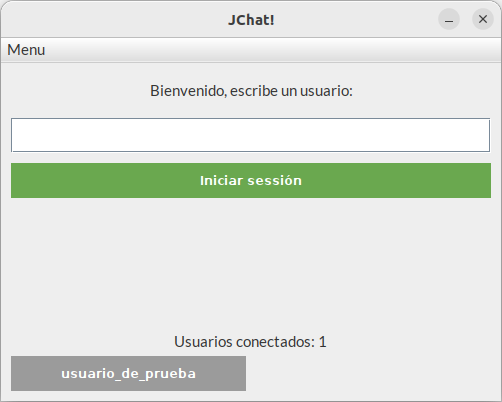
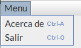
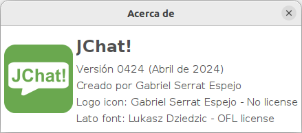
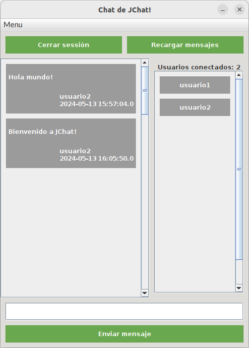

# JChat
App de chat creada en Java utilzando Swing, MySQL, patrón MVC y Singleton

## Descripción

Una aplicación que permite chatear con otros usuarios que esten conectados a esta misma aplicación.

La aplicación se conecta a una base de datos para cargar los mensajes y los usuarios conectados.

Se utilizan las librerias Java Swing para la interfaz y [mysql-connector-java-8.0.23.jar](mysql-connector-java-8.0.23) para la base de datos MySQL o MariaDB.

Se puede encontrar la base de datos de muestra en el fichero [bbdd_mysql_chat.sql](bbdd_mysql_chat.sql).

Tambien se encuentra los permisos de un usuario para hacer la conexión en [bbdd_mysql_appuser.sql](bbdd_mysql_appuser.sql).

Se utilizan los objetos de negocio [User](src/model/User.java) y [Message](src/model/Message.java) para mostrar los usuarios conectados y los mensajes de la base de datos en la interfaz.

La aplicación implementa patrón MVC (Modelo, Vista y Controlador) y las llamadas se utilizan en [UserModel](src/model/UserModel.java) y [MessageModel](src/model/MessageModel.java) con la capa de abstracción [DatabaseConnection](src/model/DatabaseConnection.java) implementando patrón Singleton.

En una máquina solo puede conectarse un usuario a la vez. Se utiliza la dirección IP del ordenador que ejecuta la aplicación.

### Procedimientos

En la base de datos hay procedimientos (PROCEDURES) que agilizan las tareas principales de los modelos:

- connect([User](src/model/User.java)) : Utilizado en [UserModel](src/model/UserModel.java). Permite añadir un usuario nuevo.
- disconnect() : Utilizado en [UserModel](src/model/UserModel.java). Permite borrar el usuario actual.
- getConnectedUsers() : Utilizado en [UserModel](src/model/UserModel.java). Permite recuperar en un ArrayList los usuarios conectados.
- send([Message](src/model/Message.java)) : Utilizado en [MessageModel](src/model/MessageModel.java). Permite enviar un mensaje nuevo.
- getMessages() : Utilizado en [MessageModel](src/model/MessageModel.java). Permite recuperar en un ArrayList los mensajes nuevos a partir del ultimo mensaje leido.

### Tablas y Objetos de negocio

Esta es la estructura de las tablas de la base de datos y sus objetos de negocio asociados:

#### User

| nick   | userhost | dateCon   | lastRead |
|--------|----------|-----------|----------|
| String | String   | Timestamp | int      |

#### Message

| id  | nick   | message | ts        |
|-----|--------|---------|-----------|
| int | String | String  | Timestamp |

## Funcionamiento

### Ventana principal

La ventana principal dispone de 3 a apartados:

#### Escribir el usuario nuevo

Un campo de texto donde escribir el nombre de usuario que va a ingresar a la sala.

Y un botón de 'iniciar sessión' que abre la ventana de chat una vez validado.

No puede haber 2 usuarios con el mismo nick y tampoco puede haber 2 usuarios con la misma dirección IP.

#### Usuarios conectados

En la parte inferior apareze una vista previa de los usuarios conectados.

#### Menu de navegación 'Programa'

Menú de navegación con 2 opciones:

- **Ctrl+A** : Abrir una venatana de Acerca del programa.
- **Ctrl+Q** : Cerrar la ventana.

### Ventana de Acerca de

Ventana de creditos del programa.

### Ventana de Chat

La ventana de chat dispone de 3 apartados:

#### Panel superior

El panel superior cuenta con 2 botones:

- 'Cerrar sessión' : Permite salir del chat y se mantiene solo la ventana principal abierta.
- 'Recargar mensajes' : Permite refrescar la ventana para cargar nuevos mensajes y los usuarios conectados.

#### Panel central

El panel central cuenta con 2 subpaneles:

- Panel de mensajes : Ubicado a la izquierda, permite mostrar los mensajes desde el momento de entrar a la sala.
- Panel de usuarios : Ubicado a la derecha, permite mostrar los usuarios conectados.

#### Panel inferior

El panel inferior cuenta con 1 campo de texto y 1 botón:

- Campo de mensaje : Permite escribir un mensaje para enviar.
- Botón 'Enviar mensaje' : Permite enviar el mensaje escrito. No se puede enviar un mensaje vacio.

## Agradecimientos

- **JChat! (Logotipo)** : Creado por Gabriel Serrat Espejo (yo).
- **Lato Font** : Creado por [yPoland Lukasz Dziedzic](mailto:team@latofonts.com). [OFL License v1.1 (26/02/2007)](src/assets/lato/OFL.txt).
- **mysql-connector-java-8.0.23 (Connector/J)** : Creado por [MySQL Community](https://downloads.mysql.com/archives/c-j/). MySQL open source software is provided under the [GPL License](http://www.gnu.org/licenses/old-licenses/gpl-2.0.html).
